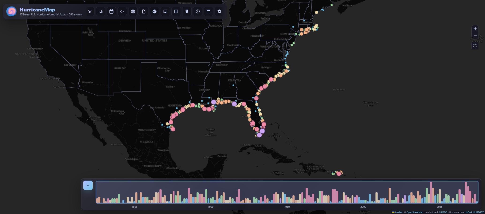
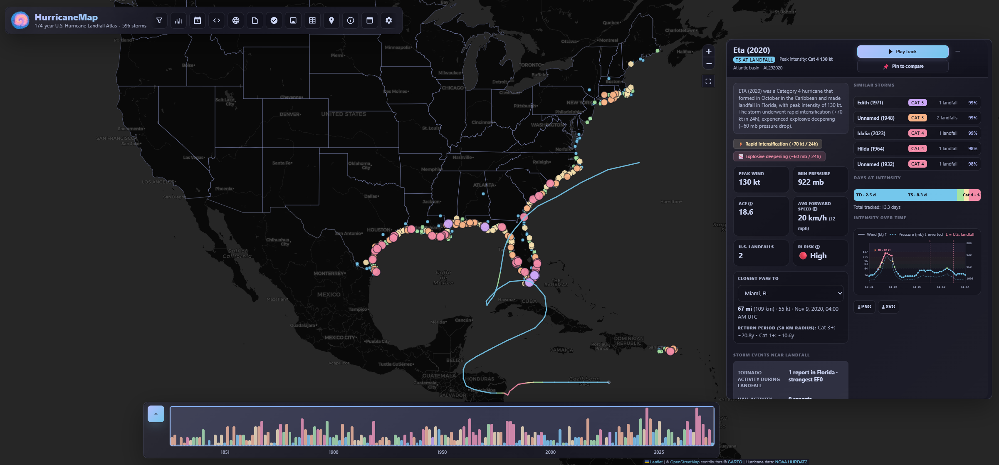

# HurricaneMap

[](https://sysadmindoc.github.io/HurricaneMap/)
[](https://github.com/SysAdminDoc/HurricaneMap/releases)
[](LICENSE)
[](#)
[](https://www.nhc.noaa.gov/data/)

> **174 years of U.S. hurricane landfalls**, every dot drawn directly from NOAA's HURDAT2 best-track database (1851–2025).
>
> **Live demo:** https://sysadmindoc.github.io/HurricaneMap/


<br>



## What this is

A static, interactive web map that plots **every recorded hurricane and tropical-storm landfall on U.S. soil**, drawn straight from the National Hurricane Center's HURDAT2 best-track database — the same source the NHC uses for its post-season analyses.

Click any dot and you get the storm's full track, its peak intensity, every U.S. landfall it made (chronological), and one-click jumps to the Wikipedia article, YouTube footage search, NOAA Tropical Cyclone Report, and the NHC storm wallet.

## Quality plan

The active quality improvement tracker lives in [`docs/QUALITY_IMPROVEMENT_PLAN.md`](docs/QUALITY_IMPROVEMENT_PLAN.md). It covers regression automation, data contracts, URL state, data provenance, service-worker update UX, accessibility coverage, visual snapshots, and maintainability work.

The app uses an offline-first service worker. Historical lookup data is preinstalled into compressed IndexedDB with CacheStorage fallback, while large local radar PNGs are cached on demand. Settings reports browser usage/quota and protects the core shell/data scopes while allowing tile or radar cleanup; an opened radar timeline can save an explicit, bounded per-storm offline pack. When shell or offline-data assets change, bump `SW_VERSION` in `sw.js`; installed users will then see an in-app reload prompt instead of silently staying on stale UI.

Persisted browser state has an explicit compatibility contract: settings, search history, and preparedness data use schema-versioned envelopes; legacy unversioned records migrate in place, while unknown future versions remain untouched and load safe defaults. Shared URL hashes emit `v=1`, continue to accept legacy unversioned links, and ignore unsupported future versions. Generated data must match the schema in `src/schema-contract.js`, and service-worker activation removes superseded caches and IndexedDB generations only after the replacement shell and offline data install.

The settings menu can save up to 20 named views on the current device. A view restores filters, map-layer choices, display units, and up to four comparison storms; it can be deleted or exported as versioned JSON. Saved views never include evacuation addresses, selected points, or other location coordinates.

Local verification:

```bash
npm install
npm test
```

Fast non-browser verification:

```bash
npm run build
```

## Highlights

- **595 storms · 759 landfall events · 374 hurricane-strength landfalls** spanning 1851–2025.
- Both **Atlantic** and **Eastern North Pacific** HURDAT2 basins ingested (so storms like Iniki '92 on Kauai are included).
- **Inferred-landfall detection** for storms whose 6-hourly track grazes U.S. land between synoptic times — fixes Iniki and similar Pacific landfalls that don't carry an explicit `L` marker in HURDAT2.
- **Hotspot / cold-spot analysis**: ranks every coastal state, lists ones that have never recorded a hurricane-strength landfall (Delaware, Maryland, Virginia, New Hampshire, Pennsylvania, DC).
- **Multi-state tracking** for storms like Andrew (FL → FL → LA), Charley (FL → FL → SC → SC), Hugo (PR → PR → SC), Katrina (FL → LA → LA).
- Per-segment **intensity-coloured tracks** — you can see exactly where a storm intensified, peaked, and weakened.
- **Track animation** — opt-in playback of a spinning hurricane glyph and translucent wind-field disk that travels the full path, both sized in real-time by Saffir-Simpson category at each track point. Starting playback collapses the storm panel to a restore tab and promotes radar sync, speed, restart, close, and scrubber controls into a compact map dock.
- **📡 Archived NEXRAD radar — full-storm timeline, offline-capable** — every storm from August 1995 onward ships with **every in-coverage 6-hourly track frame** baked into the repo. Click 📡 next to any landfall and the loop animates the entire U.S. passage of that storm from genesis-in-coverage to dissipation, with the map auto-panning to follow the eye. Katrina '05 plays back 22 frames over five days; Helene '24 shows the eyewall crossing the Big Bend. **No internet required after `git clone`.** Frames not in the local archive transparently fall back to live IEM URLs.
- **Live GOES satellite background** — when active storms exist, an opt-in setting overlays current NOAA/NESDIS/STAR GOES GeoColor sectors behind the official advisory track/cone. Atlantic, Eastern Pacific, and Central Pacific active storms automatically choose the closest live sector; see [`docs/GOES_REALTIME.md`](docs/GOES_REALTIME.md).
- **📈 Intensity time-series chart** — inline SVG in every storm panel showing wind (kt) + pressure (mb) over the storm's life, with category-colored dots, dashed pressure line (inverted so deeper storms read higher), Cat 1-5 reference bands, vertical landfall markers, and a hover crosshair tooltip.
- **🌀 Compare mode** — pin up to 4 storms, see their tracks color-coded on the map, side-by-side stat tables, mini intensity charts. Andrew '92 vs Katrina '05 vs Michael '18 in one view.
- **🔥 Density heatmap** — toggle a Catppuccin-tinted heat layer weighted by Saffir-Simpson category to show landfall hotspots vs cold spots.
- **🗺️ State deep-dive** — click any state polygon (or pick from the filter), get a panel with that state's full landfall history: by-category histogram, by-decade trend, top-5 worst on record, every storm sortable.
- **🌊 SLOSH MOM storm surge zones** — overlay NHC's Cat 1-5 maximum-of-maximums inundation maps along the U.S. Gulf and East Coast, plus the dedicated Hawaii (Cat 1-4) and Puerto Rico/USVI regional grids. Powered by NOAA's pre-rendered ArcGIS tiles — picking a category snaps the worst-case envelope into view.
- **🌬️ Wind-field swaths** — for storms 2004+, a checkbox in the storm panel renders the actual HURDAT2 wind-radii analysis (34/50/64 kt asymmetric quadrants per track point) as overlapping polygons along the path.
- **🛰️ ✈️ 🍝 🌪️ Quicklinks** — every storm panel links out to GOES satellite imagery (RAMMB SLIDER, 2018+), NOAA Storm Events tornado search filtered to the storm's dates + states, Hurricane Hunters recon archive (Tropical Atlantic mirror), Wikipedia, YouTube footage search, NOAA Tropical Cyclone Reports, and the NHC storm wallet.
- **⚠️ Impacts data** — raw Wikipedia infobox deaths/damage text plus normalized numeric fields for fatalities and nominal USD damage (208 storms covered so far; rerun `scripts/scrape_impacts.py` to fill in more).
- **📏 Observed high-water marks** — 25 modern storms (Katrina, Harvey, Sandy, Ian, Helene…) carry a toggleable layer of surveyed USGS peak-water elevations (10,700+ marks, elevation-colored, coastal vs riverine) — the ground truth to compare against the modeled SLOSH surge zones. Preprocessed from the USGS Short-Term Network (`scripts/build_hwm.py`), works offline.
- **🌊 Tide-gauge water levels ("what the water did")** — for 1990+ storms, load NOAA CO-OPS observed hourly water levels vs the predicted astronomical tide at the 2-3 gauges nearest the strongest landfall, with the peak surge residual called out (Katrina: Grand Isle +3.8 ft, S.W. Pass +4.9 ft at the Aug 29 landfall hour). Fetched live on demand — never automatically.
- **💰 Billion-dollar disasters** — 65 landfalling storms joined to NOAA NCEI's U.S. Billion-Dollar Weather and Climate Disasters record (1980–2024, CPI-adjusted to 2024 USD, official death tolls). The NCEI product was retired in May 2025, so the dataset is frozen and ships with the repo (`scripts/build_billions.py`).
- **🚨 Active storm tracking** — when NHC reports active storms, a pulsing badge appears with the official cone/track, Potential Tropical Cyclone support, advisory/discussion/name-pronunciation/rip-current links, an optional GOES backdrop, hourly feed checks, and retry/backoff status.
- **❎ NHC tropical outlook + marine warnings** — official formation disturbances render with the NHC's 2026 gray-X treatment for near-0% systems; an opt-in layer adds the 0–24 hour offshore wind-warning zones.
- **📐 Forecast-cone retrospective** — every historical storm can be overlaid with selectable 2015, 2025, or 2026 NHC error-radius tables, plus a clearly labeled illustrative reconstruction of the 2026 experimental ellipse methodology.
- **〰️ Animated risk trajectories** — an opt-in education mode replaces the cone boundary with 20 deterministic plausible center paths, scaled to the selected error era and automatically rendered without motion when reduced motion is preferred.
- **🎒 Offline preparedness planner** — a device-local EN/ES/Kreyòl checklist and household calculator sizes water and food for a three-day evacuation kit or two-week stay-at-home kit, with progress available after a fully offline reload.
- **📍 Official evacuation-zone lookup** — enter a Florida address or choose a map point to query the state-published evacuation-zone layer, with local-official caveats and direct state lookups preserved when the service is unavailable or the location is outside Florida.
- **🖼️ Filtered track gallery** — render the current historical filter set as a stylized 1800×1200 all-tracks density poster, then export a PNG with NOAA/NHC HURDAT2 attribution embedded in the artwork.
- **Progressive anchored controls** — header hints use `popover="hint"` and CSS anchor positioning in current browsers without closing the settings flyout, with equivalent fixed-position behavior retained for older engines.
- **⚠️ 2026 cone standard: coastal + inland watches/warnings** — matching the NHC's 2026 operational cone graphic, active storms overlay tropical-storm/hurricane watch and warning zones (including inland zones, CONUS/HI/PR/USVI) from `api.weather.gov`, with the official pink/blue diagonal hatch where a Hurricane Watch overlaps a Tropical Storm Warning, and an on-map legend.
- **👥 Population density** — toggle the SEDAC GPWv4 1km gridded-population overlay to see how many people live in each storm's path / surge zone.
- Search by name OR year. Filter by year range, Saffir-Simpson category, or state.

## What's new in v1.6.0 - Safety, education, and resilience (July 2026)

- **Official safety tools:** Florida address/map-point evacuation-zone lookup with local verification and outage-safe state link-outs, plus a fully offline household preparedness checklist and supply calculator.
- **2026 NHC parity:** tropical outlook gray-X symbology, Potential Tropical Cyclone support, richer official storm links, and an optional marine wind-warning outlook.
- **Uncertainty education:** historical 2015/2025/2026 cone comparisons, a qualified 2026 ellipse reconstruction, and reduced-motion-aware plausible risk trajectories.
- **Shareable track art:** current filters render as an attributed 1800×1200 PNG gallery poster, with progressive anchored header hints in supported browsers.
- **Deep reliability pass:** deterministic generated data, cancellation-safe live layers, bounded offline caches, hardened HTML/network edges, complete shell localization, contrast fixes, and expanded headless regression coverage.

## What's new in v1.5.0 - 2026 season readiness (July 2026)

- **2026 NHC cone standard**: active storms now overlay coastal *and inland* watch/warning zones with the official pink/blue dual-alert hatch, plus the NHC Peak Storm Surge forecast layer and a 2026 season outlook card (NOAA + CSU numbers, El Niño context).
- **Three new data layers**: NCEI billion-dollar disaster costs per storm, on-demand NOAA tide-gauge observed-vs-predicted water levels around landfall, and 10,700+ USGS surveyed high-water marks across 25 modern storms.
- **Fixed in production**: the 3D globe (CSP had silently killed Cesium), the SST overlay (dead dataset + wrong CRS + hidden behind the basemap — now live CoralTemp), and the active-storm badge blocking header buttons.
- **Hyper-local**: "Use my location" ranks every historical closest pass by distance and bearing; active storms show live distance to you.
- **Quality**: axe-core WCAG 2.2 AA gate, complete Haitian Creole interface-key parity with English-only educational text disclosed in every locale, global error toasts, live permalink navigation, GitHub Pages size guard.

## What's new in v1.4.6 - Desktop panel fit (July 2026)

- **Right panel uses the shelf space.** The desktop details panel now sits lower and leaves only a 6px gutter above the season/timeline shelf.
- **Less dead space.** The panel top and bottom are tuned together so the right column feels deliberately seated in the available map lane.
- **Regression coverage.** Smoke tests now fail if the right panel leaves too much empty space above the bottom shelf.

## What's new in v1.4.5 - Desktop shelf alignment (July 2026)

- **Season and timeline align.** The 2020 season card now sits inline to the left of the timeline as part of one bottom shelf instead of floating above it.
- **Panels reserve real space.** Desktop side panels now stop above the bottom shelf, leaving a clean gap and keeping the map readable.
- **Cleaner update feedback.** Toasts move into the map lane when a side panel is open instead of covering the details panel.
- **Regression coverage.** Smoke tests now assert the actual timeline selector, shelf alignment, panel spacing, and no-overlap behavior across themes and desktop viewports.

## What's new in v1.4.4 - Desktop panel refinement (July 2026)

- **Desktop panels breathe.** Analytical panels now use a wider but bounded inspector lane so charts, records, and controls are readable without covering the whole map.
- **State and stats panels are orderly.** Legacy dashboard columns were reshaped into stable two-column desktop grids that do not clip or push content offscreen.
- **Less window clutter.** The season summary now hides while a side panel is open, leaving one primary reading surface plus the map.
- **Keyboard-accessible state rows.** State storm records now expose button semantics, focus states, and Enter/Space activation.
- **Regression coverage.** Smoke tests now prove desktop panel fit, state-row accessibility, hidden competing shelves, and storm/state/stats layout across themes.

## What's new in v1.4.3 - Premium layout and settings polish (July 2026)

- **Playback gives the map priority.** On phones, active track playback now collapses the header to a compact identity strip, keeps the storm panel as a small edge restore tab, and holds the controls in a bounded dock.
- **Settings feel intentional.** Preferences now include concise helper copy, localized labels, right-anchored desktop placement, and scroll-safe mobile drawer constraints.
- **Cleaner component system.** Chips, badges, toggles, swatches, segmented controls, toasts, and playback controls now use the same 4/6/8/10/12px radius scale instead of mixed pill shapes.
- **States are clearer.** Search no-results, loading, missing-record, boot-error, and update-prompt copy now give calm recovery guidance in dark, light, and high-contrast themes.
- **Regression coverage.** Smoke tests now assert settings layout, mobile playback header compression, compact playback docks, and oversized-radius regressions across supported themes.

## What's new in v1.4.2 — Playback map-first layout (July 2026)

- **Playback clears the map.** Starting a storm track now automatically collapses the details window to a restore tab so the animated storm path stays visible.
- **Orderly playback dock.** Animation controls now live in a compact fixed map dock with restart, close, speed, radar sync, and scrubber controls arranged for desktop and phone viewports.
- **Less vertical clutter.** The timeline, season summary, compare tray, and standalone radar controls are suppressed while track playback is active.
- **Regression coverage.** Smoke tests now verify the playback layout in desktop and mobile viewports across dark, light, and high-contrast themes.

## What's new in v1.4.1 — Map-first overlay polish (July 2026)

- **Map-first overlays.** Filters now start collapsed, open as a bounded scroll drawer, and collapse the active side panel instead of stacking over it.
- **Cleaner panel lanes.** Storm, stats, table, compare, and state panels stay in a right-side lane with map controls and the timeline pushed out of their way.
- **Mobile vertical space.** The phone layout keeps the header tighter, shortens the filter drawer, hides map controls while filters are open, and leaves more map visible.
- **Smoke coverage.** Browser tests verify desktop and 390px mobile visual snapshots across themes and major surfaces, modal focus trap/return, skip-link and keyboard map alternatives, 44px mobile targets, reduced motion, the panel layout matrix, and a rendered 3D globe.

## What's new in v1.4.0 — Deep audit pass (July 2026)

A full engineering and product audit landed ~40 verified fixes plus a panel-management upgrade:

- **Panel minimize-to-tab** — every side panel (storm, statistics, comparison, state, table view, spatial results) now has a minimize button that collapses it to a slim restore tab at the map edge, so the map, timeline, and zoom controls reclaim the full viewport. Panels also strictly share one exclusive lane — no more stacking or overlap.
- **Offline storm data actually works** — the compressed storms bundle was precached but unservable, and the storms web worker had never loaded (wrong fetch paths). Storm tracks and panels now work offline, parsed off the main thread.
- **Active-storm tracking fixed on GitHub Pages** — the live NHC feed was permanently dead on the canonical deployment (proxy 404 never triggered the fallback) and was being served stale-first by the service worker.
- **Colorblind palette reaches the whole UI** — the legend, category buttons, pills, and timeline bars now switch with the map markers instead of contradicting them; marker colors resolve from the live theme tokens across dark/light/high-contrast.
- **Exports repaired** — publication CSV date columns, the statistical report's By-Month chart, and QGIS GeoJSON time attributes all derive correctly from landfall timestamps now.
- **Contrast repairs** — high-contrast and light themes meet WCAG minimums on accent controls, category pills, dim text, and focus rings; the climatology chart (previously invisible in every theme) renders.
- **Honest data labeling** — the sea-surface-temperature overlay is labeled as the September 2024 snapshot it is.

## Premium UX/UI Polish

The interface has undergone a premium-polish pass focused on clarity, trust, accessibility, and a more cohesive product feel:

**Interaction Refinements**
- **Theme system hardening** — Dark, Light, System, colorblind palette, and high-contrast modes now share semantic tokens for surfaces, controls, focus rings, disabled states, alerts, Leaflet controls, and panel overlays.
- **Panel lane stabilized** — Storm, statistics, comparison, state, and "on this date" panels now share one fixed responsive side lane with mobile collision handling, so panels no longer overlap controls or each other.
- **Keyboard-friendly search** — Search results now behave like a proper combobox/listbox with arrow-key navigation, Enter selection, Escape close, active-result highlighting, and clearer empty states.
- **Resilient loading feedback** — Required data-load failures now surface a calm, actionable error card with retry guidance instead of silently rendering a broken empty map.
- **Map-first playback controls** — Track playback now collapses the storm panel to a restore tab and uses a compact fixed map dock, keeping the animated path visible while controls stay orderly.
- **Readable playback state** — The active Play/Pause button uses a high-contrast dark active surface with light text so playback state remains legible.
- **Reserved overlay shelf** — Compare and radar controls now live above the bottom timeline and outside the side-panel lane, reducing collisions between floating controls.
- **Season summary shelf** — Single-year season summaries now sit in the open map shelf instead of underneath the filter/year range panel or bottom timeline.
- **Exclusive marker previews** — Landfall marker previews are now single-owner interactions, so one hover card opens at a time and stale previews are cleared when the pointer leaves the marker.
- **Cleaner map controls** — The Leaflet zoom control now lives in a side-panel-aware top-right lane, and the year-range Reset button stays inside the left filter panel.
- **Deterministic year picking** — Timeline clicks now select the exact clicked year, drags select ranges, and double-click resets the full 1851–2025 span without competing click/drag events.
- **State-filtered timeline** — Selecting a state now updates the year timeline to show *only* that state's landfalls, reducing visual noise and improving clarity.
- **Histogram color intensity** — Category and decade bars now feature colored fills (matching Saffir-Simpson category colors), with opacity scaled to storm count, making patterns immediately recognizable.

**Component Polish**
- **Unified panel surfaces** — Side panels, settings, comparison, empty states, stats sections, compact season summaries, closest-pass cards, and toast feedback now use a consistent surface, radius, spacing, and border language.
- **Input focus states** — All inputs, selects, and forms now provide visual feedback with box-shadow rings, color transitions, and smooth 120ms animations.
- **Button system refinement** — Across all button types: transform feedback (hover lift via `translateY`), elevated shadows, improved contrast, and consistent focus visibility.
- **Search results** — Fade-in animations, smoother hover feedback with padding animation.
- **State storm rows** — Hover effects with background transitions for better affordance.
- **Intensity chart** — Subtle border and shadow feedback on interaction.
- **Compare cards** — Hover effects with border lightening and shadow elevation.
- **Animation scrubber** — Thumb element scales on hover with improved box-shadow feedback.
- **Checkbox interactions** — Scale transform on hover (1.05) for better tactile feedback.

**Visual Hierarchy & Consistency**
- **Unified transition timing** — All animations use consistent 120ms `ease` or cubic-bezier easing for a cohesive feel.
- **Shadow elevation system** — 3-level shadow depth (2px/4px, 4px/12px, 6px/16px) creates clear visual hierarchy.
- **Color palette** — Catppuccin Mocha throughout with semantic color usage (category-specific storm coloring, state-specific histogram fills).
- **Spacing rhythm** — Consistent 8px grid system respected across all panels, cards, and sections.

**Accessibility Enhancements**
- **Focus ring visibility** — Subtle but clear `0 0 0 3px` lavender-tinted rings across all interactive elements.
- **Keyboard navigation** — Full support for Escape, Tab, and Enter workflows.
- **Screen-reader semantics** — Search, glossary, panels, loading, error, and empty states expose clearer roles, labels, and status messaging.
- **Color contrast** — Maintained throughout all states per WCAG standards.
- **Reduced motion** — Respected where supported.
- **Non-color encoding** — Category markers use distinct dash patterns (solid/dashed/dotted/mixed) in addition to color, satisfying WCAG 1.4.1.
- **Data table alternative** — "Table view" button renders filtered landfalls as a sortable, keyboard-navigable HTML table (Section 508 compliance).
- **VPAT published** — See [`docs/VPAT.html`](docs/VPAT.html) for the full WCAG 2.2 AA Voluntary Product Accessibility Template.
- **Internationalization** — English, Spanish (ES-LA), and Haitian Creole (Kreyòl) interface locales with browser auto-detection. Glossary definitions and generated storm narratives remain English source content and are visibly labeled as such in each locale.

## Phase 8: Mobile Optimization & Advanced Features

**Mobile-First Responsive Design**
- **WCAG AAA touch targets** — All interactive elements now meet the 44×44px minimum standard on mobile (720px and below): header icon buttons, Leaflet zoom controls, year inputs, category toggles. Leaflet controls gain rounded corners for better ergonomics.
- **Improved mobile panel layout** — Panels and filters optimized for small screens with responsive cascading at 720px, 640px, and 430px breakpoints.

**Dark/Light Theme Toggle**
- **Catppuccin Mocha and Latte** — Switch between dark and light themes via the settings menu. Selection persists to localStorage. Smooth CSS-variable swap without page reload.
- **All elements theme-aware** — Category colors, backgrounds, text colors, and all UI elements adjust automatically.

**Advanced Storm Comparison**
- **Diff highlighting in comparison table** — Max values highlighted in green, min values in red/pink. Instantly see which pinned storms stand out on each metric (peak wind, pressure, landfall count, track points, ACE).

**Decade-by-Decade Trend Analysis**
- **New statistics table** — Six-column analysis by decade: named-storm count, major-hurricane %, ACE total, deadliest storm, and costliest storm. Hover reveals death/damage details. Complements the annual climatology chart.

**Performance Optimizations**
- **Core Web Vitals monitoring** — Opt-in (`?perf` or `hm-debug-perf`) tracking of LCP (Largest Contentful Paint), INP (Interaction to Next Paint), and CLS (Cumulative Layout Shift) logged to the browser console.
- **CSS rendering optimizations** — `will-change` hints on frequently-animated elements (buttons, charts, action controls) reduce layout thrashing.
- **Lazy-load infrastructure** — Foundation for on-demand loading of non-critical modules (e.g., radar overlay) to reduce initial bundle impact.

## Quick start

The map is **already published** on GitHub Pages — open https://sysadmindoc.github.io/HurricaneMap/ and you're done.

To run locally (e.g. after refreshing the HURDAT2 data):

```bash
# Clone
git clone https://github.com/SysAdminDoc/HurricaneMap.git
cd HurricaneMap
npm install

# Check NOAA for newer HURDAT2 source files.
# Use --apply before preprocessing when a new revision is detected.
node scripts/refresh-hurdat2.mjs --dry-run

# Rebuild derived JSON after raw HURDAT2 data changes.
# (Already pre-built JSON lives in data/ so you can skip this step entirely.)
python scripts/preprocess_hurdat2.py

# Serve locally — `fetch()` won't work over file:// in modern browsers.
python -m http.server 8765
# open http://127.0.0.1:8765/
```

Use `node scripts/refresh-hurdat2.mjs --dry-run` to check NOAA's HURDAT2 directory locally. When source files change, rerun with `--apply`, rebuild derived JSON with `python scripts/preprocess_hurdat2.py`, then validate with `npm test`.

Optional edge deployment: [`docs/CLOUDFLARE_CDN.md`](docs/CLOUDFLARE_CDN.md) documents the Cloudflare Worker CDN wrapper, cache policy, image optimization hints, and curl checks for before/after latency validation.

Self-hosting: [`docs/SELF_HOSTING.md`](docs/SELF_HOSTING.md) documents the Docker image, port mapping, healthcheck, and offline/intranet deployment notes.

Live satellite backdrop: [`docs/GOES_REALTIME.md`](docs/GOES_REALTIME.md) documents the opt-in NOAA/NESDIS/STAR GOES sector overlay, source URLs, refresh cadence, and static-app tradeoffs.

### Dependency security policy

Runtime mapping code is deliberately pinned: Leaflet 1.9.4 is vendored locally for offline use, while Cesium 1.143 is loaded only for the optional globe with exact script and stylesheet integrity hashes. Updating either requires checking its upstream license/release, changing the complete pinned asset pair, and passing the desktop/mobile map and globe smokes.

Build and test dependencies use maintained npm release lines: esbuild 0.28.1 (MIT), Playwright 1.62.0 (Apache-2.0), and axe-core Playwright 4.12.1 (MPL-2.0). Before merging an update, run `npm outdated`, `npm audit --audit-level=high`, and `npm test`; the latter includes the bundle budget, browser accessibility/layout checks, offline service-worker check, and Cesium globe smoke. Playwright 1.62+ requires Node.js 20 or newer.

## Data Export & Research

**Export filtered data as publication-ready CSV:**

HurricaneMap includes a one-click CSV export button (📄 icon in the header) that downloads your filtered dataset with:

- **Full documentation:** data dictionary, methodology notes, NOAA citation, attribution requirements
- **All landfall fields:** storm ID, name, year, month, day, hour, latitude, longitude, wind speed (kt/mph), pressure, Saffir-Simpson category, state
- **Timestamped filename:** `HurricaneMap-Export-YYYY-MM-DD.csv`
- **Proper CSV escaping:** handles commas, quotes, and newlines

Perfect for:
- Academic research papers (includes full HURDAT2 citation)
- Climate & seasonal analysis
- Geographic & statistical software (ArcGIS, R, Python, QGIS)
- Spreadsheet analysis (Excel, Google Sheets)

See [LICENSE.md](LICENSE.md#how-to-cite-hurricanemap) for citation formats.

## Project layout

```
HurricaneMap/
├── index.html              # entry — map shell
├── manifest.webmanifest    # PWA manifest
├── src/
│   ├── main.js             # app boot, filters, search, UI wiring
│   ├── data.js             # JSON loaders + index helpers
│   ├── map.js              # Leaflet map, markers, tracks
│   ├── panel.js            # storm details + Wikipedia/YouTube/NOAA links
│   ├── animation.js        # spinning hurricane glyph + wind-field disk along the track
│   ├── radar.js            # NEXRAD overlay — local manifest first, IEM fallback
│   ├── stats.js            # state hotspot / decade / category breakdowns
│   └── styles.css          # Catppuccin Mocha + glassmorphism
├── data/
│   ├── hurdat2-atlantic.txt    # raw NOAA Atlantic best-track (1851–2025)
│   ├── hurdat2-nepac.txt       # raw NOAA Eastern Pacific best-track (1949–2025)
│   ├── us-states.geojson       # US state polygons (point-in-polygon attribution)
│   ├── landfalls.json          # flat list, one entry per US landfall event
│   ├── storms.json             # full track + metadata for every US-landfalling storm
│   ├── stats.json              # pre-computed stats: by state, decade, category, cold spots
│   ├── metadata.json           # generated source provenance, coverage, and output metadata
│   └── radar/                  # archived NEXRAD composites (~512 MB, 1700+ frames)
│       ├── manifest.json           # storm_id → {landfalls, frames}
│       ├── Katrina-2005/           # one folder per storm
│       │   ├── t_200508241800.png
│       │   ├── t_200508250000.png
│       │   └── ...
│       └── ...
├── scripts/
│   ├── refresh-hurdat2.mjs   # NOAA HURDAT2 detector/downloader for local refreshes
│   ├── preprocess_hurdat2.py   # HURDAT2 parser + landfall attribution + stats roll-up
│   ├── scrape_impacts.py       # Wikipedia impact scraper + normalized fatality/damage fields
│   └── scrape_radar.py         # IEM NEXRAD scraper — populates data/radar/
└── examplemap.png          # design reference
```

## How landfalls are detected

HURDAT2 marks a `L` record-identifier on track points where the cyclone center crosses a coastline. We use this **as the primary signal** for every landfall.

For storms without an `L` marker — most commonly EPac/CPac storms hitting Hawaii (the marker convention is "continental U.S. only") and a handful of 1971–1990 storms (a documented HURDAT2 marking gap) — we fall back to **inferred landfall detection**:

1. For each consecutive pair of 6-hourly track points, classify each as *inside-a-state* via point-in-polygon against the U.S. Census Bureau state boundaries.
2. Whenever the track transitions from offshore → onshore while at TS+ intensity, that's a landfall.
3. If both endpoints are offshore but the great-circle segment crosses land (which happens with small islands like Kauai), sample 10 mid-segment positions and place the inferred landfall at the first one inside a state polygon. Wind/pressure interpolated linearly.
4. EPac-basin inferred landfalls are restricted to coastal Pacific states (HI, CA, OR, WA, AK) — otherwise EPac storms tracking up through Mexico produce spurious "landfalls" in landlocked Arizona / New Mexico.

Inferred landfalls are flagged with an `inferred` tag in the storm panel so you can tell them apart from official `L`-marker landfalls.

## Saffir-Simpson at landfall

| Category | Sustained wind | Color |
| -------- | -------------- | ----- |
| TS / sub-hurricane | 34–63 kt | sapphire |
| Cat 1 | 64–82 kt | green |
| Cat 2 | 83–95 kt | yellow |
| Cat 3 (major) | 96–112 kt | peach |
| Cat 4 | 113–136 kt | pink |
| Cat 5 | 137+ kt | mauve |

A storm's **headline landfall category** is the highest category recorded at *any* of its U.S. landfalls — so a storm that peaks offshore and lands as a TS shows up as TS, not as its peak intensity.

## Known data quirks

- **1971–1990 has known gaps in HURDAT2's continental-U.S. landfall marking.** Some real landfalls are missing or under-categorized; the inferred-landfall pass picks up most of them but a few are absent because the 6-hour track doesn't cross a polygon.
- **Pre-1944** (no aircraft reconnaissance) and **pre-late-1960s** (no satellite) systematically under-sample storm count and bias intensities low — see Landsea & Franklin 2013.
- **Wind radii** (34/50/64 kt) only present from 2004 onward in HURDAT2; modern storms use them for 2D swaths, 3D wind cones, and the screening exposure metric. **Radius of maximum wind** only begins in 2021 and remains too sparse for historical comparison.
- **Hawaii 1959 Hurricane Dot, 1992 Iniki** etc. are inferred landfalls because HURDAT2's `L` marker convention doesn't apply outside continental U.S. The category is interpolated from the nearest 6-hour position.

## Data Sources, Licensing & Attribution

### Data build provenance

Every preprocessing run writes `data/metadata.json` alongside the generated landfall, storm, and stats files. It records the source HURDAT2 filenames, local source modification dates, source storm-year ranges, output file metadata, generator name, app version, and coverage counts. The About dialog surfaces this build summary so users can confirm exactly which data bundle they are viewing.

### Open Data License Clarity

**HurricaneMap is built on entirely open and public data.** All datasets carry clear, permissive licenses:

| Dataset | Source | License | Citation |
| --- | --- | --- | --- |
| **HURDAT2 Best-Track** | [NOAA National Hurricane Center](https://www.nhc.noaa.gov/data/) | Public Domain (U.S. Govt) | Landsea, C. W. & Franklin, 2013 |
| **NEXRAD Radar Archive** | [Iowa State IEM](https://mesonet.agron.iastate.edu/) | Public Domain | Acknowledgment required |
| **Population Density (GPWv4)** | [SEDAC, Columbia University](https://sedac.ciesin.columbia.edu/) | CC BY 4.0 | [See attribution](LICENSE.md#population-density) |
| **State Boundaries** | [U.S. Census Bureau TIGER](https://www.census.gov/geographies/mapping-files/time-series/geo/tiger-line-file.html) | Public Domain | Acknowledgment required |
| **Storm Impacts** | [Wikipedia](https://en.wikipedia.org/) | CC BY-SA 3.0 | [See details](LICENSE.md#storm-impacts-data) |
| **Map Tiles** | [OpenStreetMap](https://www.openstreetmap.org/) | ODbL | © OSM contributors |

### For Research & Publications

**When using HurricaneMap data in research, reports, or presentations,** please:

1. **Acknowledge NOAA/NHC** as the original data source for all hurricane/landfall data:
   > "Historical hurricane landfall data sourced from NOAA's National Hurricane Center HURDAT2 database (https://www.nhc.noaa.gov/data/)"

2. **See [LICENSE.md](LICENSE.md) for:**
   - Per-dataset attribution requirements (SEDAC, Wikipedia, OpenStreetMap, etc.)
   - Full citation formats (Chicago, APA, BibTeX)
   - Data accuracy & pre-satellite-era caveats
   - Landfall detection methodology

3. **Link to HurricaneMap GitHub:** https://github.com/SysAdminDoc/HurricaneMap

### Data Accuracy Notes

- **Pre-1944** (no aircraft) and **pre-1960s** (no satellite): lower completeness and accuracy
- **1971–1990**: documented gaps in continental U.S. landfall marking in HURDAT2
- **Historical uncertainty:** Pre-1900 tracks have ±100+ km uncertainty; modern (post-1960) ±10–20 km
- **More details:** [Data Accuracy & Disclaimers in LICENSE.md](LICENSE.md#data-accuracy--disclaimers)

---

## Data sources & credits (Detailed table)

| What | Where |
| ---- | ----- |
| Atlantic best-track (HURDAT2) | https://www.nhc.noaa.gov/data/ |
| Eastern Pacific best-track (HURDAT2) | https://www.nhc.noaa.gov/data/ |
| Format spec | [Landsea, C. W. — *Atlantic hurricane database uncertainty*, MWR 2013](https://www.aoml.noaa.gov/hrd/Landsea/landsea-franklin-mwr2013.pdf) |
| Archived radar (NEXRAD composites) | [Iowa State IEM NEXRAD mosaic archive](https://mesonet.agron.iastate.edu/docs/nexrad_mosaic/) — fetched live (CORS-enabled), no preprocessing |
| State boundaries | [PublicaMundi MappingAPI](https://github.com/PublicaMundi/MappingAPI) (US Census Bureau TIGER) |
| Map tiles | [CartoDB Dark Matter](https://carto.com/) over OpenStreetMap |
| Map library | [Leaflet 1.9](https://leafletjs.com/) |

## Refreshing the radar archive

Radar PNGs in `data/radar/` come from the [Iowa State IEM NEXRAD archive](https://mesonet.agron.iastate.edu/docs/nexrad_mosaic/). They're committed to the repo so the tool works offline, but you can re-scrape them at any time.

> **Size budget:** GitHub Pages hard-caps published sites at **1 GB** and the tracked tree is already ~520 MB (radar ~500 MB). `npm run build` fails above a 900 MB guard (`scripts/check-pages-size.mjs`) — if you densify the radar archive past that, serve the frames from the Cloudflare worker CDN ([docs/CLOUDFLARE_CDN.md](docs/CLOUDFLARE_CDN.md)) instead of committing them.

```bash
# Default — every covered landfall + every in-coverage TS+ track point
# at HURDAT2's native 6-hourly cadence. ~330 MB on first run.
python scripts/scrape_radar.py

# Subset to hurricane-strength only (~195 MB)
python scripts/scrape_radar.py --hurricane-only

# Major hurricanes only (~68 MB)
python scripts/scrape_radar.py --major-only

# Just the landfall frames, no full track (~35 MB)
python scripts/scrape_radar.py --landfalls-only

# Densify to hourly cadence between HURDAT2 records (multi-GB — needs LFS)
python scripts/scrape_radar.py --cadence 60

# Resume / refill — existing files are skipped automatically
python scripts/scrape_radar.py
```

Scraper flags:

| Flag | Default | Effect |
| ---- | ------- | ------ |
| `--cadence MIN` | 360 (= 6h) | Densify track-point fetches to N-min interpolation between HURDAT2 records |
| `--hurricane-only` | off | Skip storms that landed at TS strength only |
| `--major-only` | off | Skip everything below Cat 3 at landfall |
| `--landfalls-only` | off | Skip the full-track expansion, fetch only landfall frames |
| `--start YYYY` / `--end YYYY` | none | Year-range filter |
| `--force` | off | Re-download even if file exists locally |
| `--concurrency N` | 8 | Parallel HTTP fetches |
| `--dry-run` | off | Print task count + estimated MB without downloading |

## Manual HURDAT2 Refresh

Check for NOAA HURDAT2 updates locally, then apply and rebuild when a newer source file is available:

```bash
# Check current NOAA filenames and whether local files differ.
node scripts/refresh-hurdat2.mjs --dry-run

# Apply detected updates when changes are available.
node scripts/refresh-hurdat2.mjs --apply

# Find the latest filenames at https://www.nhc.noaa.gov/data/hurdat/
# Manual fallback example using a 2026 season update:
curl -sSL -o data/hurdat2-atlantic.txt \
  "https://www.nhc.noaa.gov/data/hurdat/hurdat2-1851-2026-02272026.txt"
curl -sSL -o data/hurdat2-nepac.txt \
  "https://www.nhc.noaa.gov/data/hurdat/hurdat2-nepac-1949-2026-02272026.txt"

python scripts/preprocess_hurdat2.py
```

The preprocessor refreshes `data/landfalls.json`, `data/storms.json`, `data/stats.json`, and `data/metadata.json`. Impact rows can be refreshed with `python scripts/scrape_impacts.py`; use `python scripts/scrape_impacts.py --normalize-existing` after source-format fixes that should be applied to the existing `data/impacts.json` without a network scrape. Then run `npm test`, bump the version, update `CHANGELOG.md`, commit, and create a release.

## License & Attribution

**Software:** MIT — see [LICENSE](LICENSE)  
**Data Sources:** See [LICENSE.md](LICENSE.md) for detailed attribution

This project aggregates data from multiple sources:
- **HURDAT2 Best-Track Database** — NOAA National Hurricane Center (public domain)
- **SLOSH Storm Surge Zones** — NOAA NHC (public domain)
- **NEXRAD Archived Radar** — NOAA / Iowa Environmental Mesonet (public domain)
- **Population Density** — SEDAC GPWv4, Columbia University (CC BY 4.0)
- **Storm Impacts** — Wikipedia (CC BY-SA 3.0)

**When using HurricaneMap in research or publications:** Cite NOAA/NHC as the original data source. See [LICENSE.md](LICENSE.md) for full citation formats and per-dataset attribution requirements.
